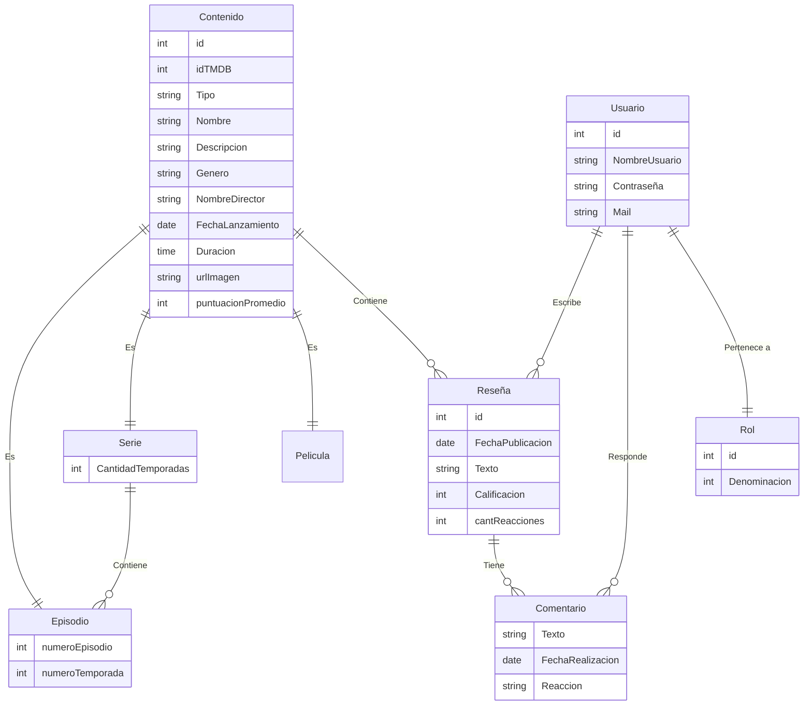

# Trabajo Práctico Integrador para .NET

## Integrantes
* Julia Aguaya - Legajo 49459
* Martín Quagliardi - Legajo 51657
* Laureano Toloza - Legajo 51871

## Enunciado
El trabajo consiste en una aplicación para realizar reseñas y comentarios sobre distintos tipos de contenido ya sean películas, series, o episodios puntuales. Los usuarios pueden crear un perfil y empezar a reseñar un contenido que hayan visto y recibir un feedback por parte de los otros usuarios en forma de comentarios.

En este trabajo usamos la API de TMDB para que los usuarios puedan buscar películas o series que no existan ya en nuestra base de datos.

## Modelo
